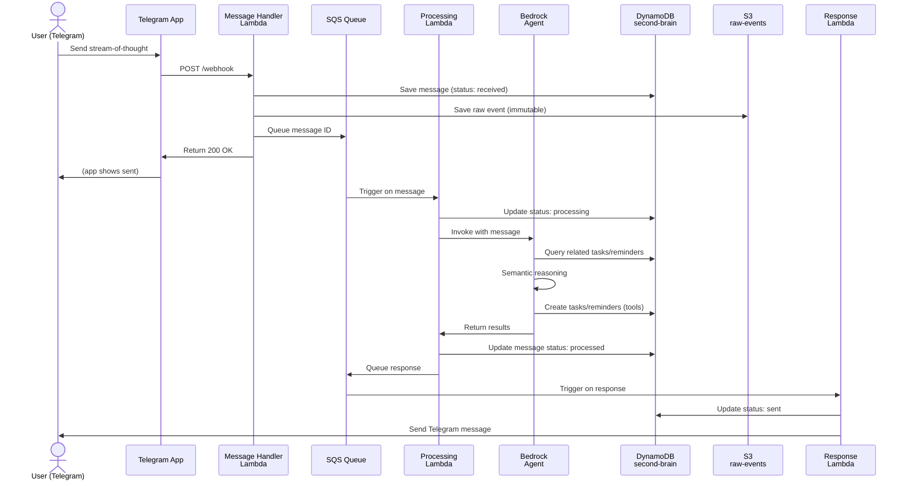
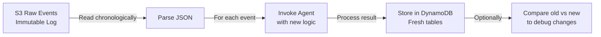
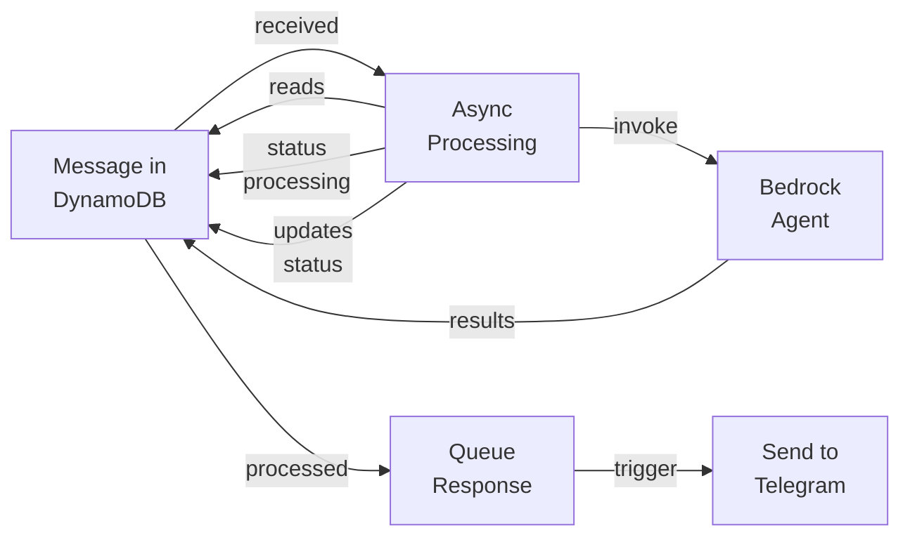

# Second Brain - Architecture

## Overview

Second Brain is a personal knowledge management system that transforms stream-of-thought messages into structured, actionable items. Users send raw thoughts via Telegram, which are processed by a Bedrock agent that categorizes, schedules, and organizes information. All raw messages are immutably stored for replay and system evolution.

## System Architecture

```mermaid
graph TB
    TG["📱 Telegram App"]
    WEBHOOK["🔗 Lambda Function URL<br/>Message Handler"]
    QUEUE["📨 SQS Queue"]
    PROCESS["⚙️ Lambda<br/>Processing"]
    AGENT["🤖 Bedrock Agent<br/>bedrock/cdk"]
    DB["🗄️ DynamoDB<br/>second-brain"]
    S3["💾 S3<br/>second-brain-data"]
    RESPONSE["📤 Lambda<br/>Response Handler"]

    TG -->|POST webhook| WEBHOOK
    WEBHOOK -->|write| DB
    WEBHOOK -->|write| S3
    WEBHOOK -->|send| QUEUE
    WEBHOOK -->|200 OK| TG

    QUEUE -->|trigger| PROCESS
    PROCESS -->|invoke| AGENT
    PROCESS -->|write results| DB
    PROCESS -->|send| QUEUE

    AGENT -->|query| DB
    AGENT -->|semantic memory| AGENT

    QUEUE -->|trigger| RESPONSE
    RESPONSE -->|update| DB
    RESPONSE -->|POST| TG
```



## Components

### 1. Data Layer

#### DynamoDB: `second-brain`
Single-table design with flexible PK/SK patterns. All item types stored together with `type` field for filtering.

**Partition Key (PK):** `user#<user_id>`
**Sort Keys:** Type-specific patterns
```
message#<timestamp>#<message_id>
task#<task_id>
todo#<todo_id>
reminder#<reminder_id>
```

#### S3: `second-brain-data`
Immutable raw event log with folder structure for easy querying and replay.

```
s3://second-brain-data/
  ├── raw-events/
  │   └── {user_id}/{year}/{month}/{day}/{message_id}.json
  ├── vector-embeddings/
  │   └── {namespace}/{embedding_id}.json
```

### 2. API Layer

**Lambda Function URL** - Telegram webhook endpoint
- Parses incoming Telegram messages
- Stores raw message to DynamoDB + S3
- Queues message for async processing
- Returns 200 OK immediately

**No API Gateway** - Function URL is simpler for single webhook.

### 3. Processing Layer

**SQS Queue** - Message buffer between webhook and processing

**Processing Lambda** - Orchestration
- Reads message from SQS
- Updates message status in DynamoDB
- Invokes Bedrock agent (bedrock/cdk)
- Stores results (tasks, reminders) in DynamoDB
- Queues response for delivery

**Bedrock Agent Lambda** (bedrock/cdk) - AI Decision Making
- Receives user message
- Accesses semantic memory via AgentCore
- Uses tools to query/modify DynamoDB
- Decides what actions to take
- Returns categorized results

**Response Lambda** - Delivery
- Reads processed results from SQS
- Sends response back to Telegram
- Updates message status to "sent"

### 4. Shared Library: `second_brain_core`

Python SDK for both application and bedrock stacks:
- **models.py** - Pydantic data models with DynamoDB serialization
- **dynamodb.py** - DynamoDBClient wrapper
- **constants.py** - Shared enums and patterns

Located in `/lib/python/second_brain_core`, installed as editable dependency.

## Message Flow



## Data Models

### Message
Raw input from Telegram, immutable metadata.

```
PK: user#<user_id>
SK: message#<timestamp>#<message_id>
Fields:
  - telegram_message_id: str
  - raw_content: str (the actual message text)
  - status: "received" | "processing" | "processed" | "failed" | "sent" | "archived"
  - s3_key: str (path to immutable raw event)
  - created_at: str (ISO format)
  - ttl: int (30 days, for auto-delete)
```

### Task
Actionable item extracted from messages.

```
PK: user#<user_id>
SK: task#<task_id>
Fields:
  - title: str
  - description: str (optional)
  - status: "pending" | "completed" | "archived"
  - due_date: str (ISO format, optional)
  - priority: "high" | "medium" | "low"
  - category: str (evolving: work, personal, health, etc)
  - source_message_id: str (trace back to original thought)
  - created_at: str
  - updated_at: str (optional)
  - completed_at: str (optional)
```

### Todo
Simple list items without deadline structure.

```
PK: user#<user_id>
SK: todo#<todo_id>
Fields:
  - text: str
  - completed: bool
  - order: int
  - created_at: str
```

### Reminder
Scheduled notifications with optional recurrence.

```
PK: user#<user_id>
SK: reminder#<reminder_id>
Fields:
  - title: str
  - scheduled_for: str (ISO timestamp)
  - status: "pending" | "sent" | "dismissed"
  - recurrence: "once" | "daily" | "weekly" | "monthly"
  - source_message_id: str (optional, trace back)
  - created_at: str
  - sent_at: str (optional)
```

### Extensible Pattern
Categories and types evolve without schema changes:
- Add new item type? Just create new `SK` pattern
- Add new category? Just store as string value
- No migrations needed

## Data Replay Capability

All raw messages are immutably stored in S3 for system evolution and debugging.



### Replay Process

```bash
# 1. Deploy fresh infrastructure (or use separate environment)
npm run cdk:deploy

# 2. Read all raw events from S3 in chronological order
aws s3 ls s3://second-brain-data/raw-events/{user_id}/{year}/{month}/{day}/ | sort

# 3. For each raw event, re-invoke agent
for event in $(aws s3 ls ...):
  - Download from S3
  - Parse JSON
  - Invoke bedrock agent with same input
  - Store results in DynamoDB

# Result: All tasks/reminders rebuilt under new agent logic
```

**Why this matters:**
- Agent logic changes? Replay to see how past thoughts would be categorized
- Schema changes? All data can be reconstructed
- Debugging? Check what happened at each step

## Async Processing with SQS

Messages are queued for async processing to:
- Return webhook response immediately (Telegram best practice)
- Decouple message reception from processing
- Handle processing failures with retry/DLQ
- Scale processing independently



## Shared Library: `second_brain_core`

Provides data models and DynamoDB operations for both application and bedrock stacks.

### Usage

```python
# In bedrock/src/tools/task_tool.py or scripts/deploy.py
from second_brain_core import Task, DynamoDBClient

# Create a task
task = Task(
    user_id="user123",
    task_id="task_abc",
    title="Buy groceries",
    category="personal",
    source_message_id="msg_123"
)

# Convert to DynamoDB format
db_item = task.to_dynamo()

# Or use client
client = DynamoDBClient()
client.put_item(task)

# Retrieve and deserialize
retrieved = client.get_item("user123", "task#task_abc", Task)
```

### Structure

```
/lib/python/second_brain_core/
  /__init__.py
  /models.py          # Pydantic models: Task, Todo, Reminder, Message
  /dynamodb.py        # DynamoDBClient
  /constants.py       # Enums, SK patterns, defaults
```

## Environment Variables

Both stacks read from environment:

```bash
# DynamoDB & S3
DYNAMODB_TABLE_NAME=second-brain
S3_BUCKET_NAME=second-brain-data

# Lambda
BEDROCK_AGENT_FUNCTION_NAME=bedrock-agent-runtime
AWS_REGION=us-east-1

# Telegram (optional, for response handler)
TELEGRAM_BOT_TOKEN=xxx
TELEGRAM_CHAT_ID=xxx
```

## Deployment

### Root Infrastructure (cdk/)

```bash
cd cdk
npm install
npm run cdk:synth
npm run cdk:deploy ApplicationStack
```

Deploys:
- DynamoDB table
- S3 bucket with prefixes
- Lambda Function URL
- SQS Queue
- Processing Lambda
- IAM roles/policies

### Bedrock Agent (bedrock/cdk)

```bash
cd bedrock/cdk
npm install
npm run cdk:deploy
```

Deploys:
- AgentCore runtime
- Agent code in Docker
- MCP gateway (if using external tools)

### Shared Library

Installed as editable dependency in both:
```
bedrock/requirements.txt:    -e ../../lib/python
scripts/pyproject.toml:      path = "../lib/python"
```

## Development Workflow

### Local Testing

```bash
# Set env vars
export DYNAMODB_TABLE_NAME=second-brain
export S3_BUCKET_NAME=second-brain-data
export AWS_REGION=us-east-1

# Test against local DynamoDB
docker run -p 8000:8000 amazon/dynamodb-local

# Run agents/scripts
python bedrock/src/main.py
python scripts/test_flow.py
```

### Making Changes

1. **Update data model?** → Modify `/lib/python/second_brain_core/models.py`
2. **Add new item type?** → Add new Pydantic model with SK pattern
3. **Change agent logic?** → Modify `bedrock/src/main.py`
4. **Add processing step?** → Update root cdk Processing Lambda

Both stacks automatically see changes (editable install).

## Observability

### Structured Logging

All Lambda functions emit JSON logs with `observability` field:

```python
import json
import sys

def log_observability(event_type: str, details: dict):
    log_entry = {
        "observability": event_type,
        "timestamp": datetime.utcnow().isoformat(),
        **details
    }
    print(json.dumps(log_entry), file=sys.stderr)

# Usage
log_observability("message_received", {"user_id": "123", "message_id": "abc"})
log_observability("task_created", {"task_id": "xyz", "category": "personal"})
```

### CloudWatch Logs Insights

Query and dashboard all observability events:

```
fields @timestamp, observability, user_id, message_id, task_id
| stats count() by observability
| sort count() desc
```

No X-Ray or CloudWatch alarms - structured logs + Insights dashboard.

## Security Considerations

- **DynamoDB encryption**: Enabled at rest (AWS managed keys)
- **S3 encryption**: Enabled, enforce SSL
- **Lambda execution**: IAM roles with least privilege
- **Secrets**: Telegram token in Secrets Manager (not .env)
- **No hardcoded user ID**: Use PK pattern `user#<user_id>`

## Future Enhancements

- Multi-user support (extend PK patterns)
- Reminder execution via EventBridge scheduled rules
- Vector search on semantic embeddings
- Mobile app (instead of Telegram webhook)
- Custom tool training via feedback loop
